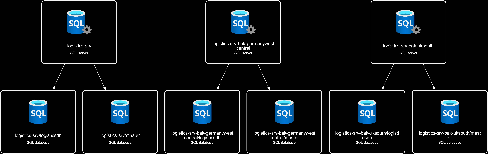
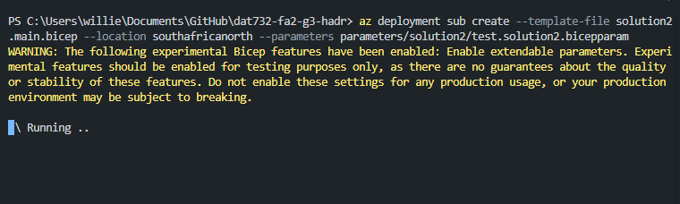

# Table of contents
1. [Solution: using geo-replication](#solution-using-geo-replication)
2. [Deploy Example](#deploy-example)
3. [Deployment Results in Azure Portal](#deployment-results-in-azure-portal)
4. [Testing Failover with a Forced Failover](#testing-failover-with-a-forced-failover)
5. [Cleanup](#cleanup)
# Solution: using geo-replication


**Introduction**
In this example we are using [geo-replication](https://learn.microsoft.com/en-us/azure/azure-sql/database/active-geo-replication-overview?view=azuresql&tabs=tsql) to replicate the company's main logistics database, hosted on azure. This helps us to provide high availability and will prove helpful in the event of a disaster recovery. 

We create two replica instances of ``logisticsdb`` hosted on the following servers:
- logistics-srv-bak-germanywestcentral (Standby , Non-Readable)
- logistics-srv-bak-uksouth (Standby , Readable)
## Prerequisites
The repository should be cloned, azure cli installed and login performed. Should be within the root folder of the repository.

## SQL Admin Login Details
```
Username: AzureAdmin
Password: R78Y9iRo71A5710
```

# Deploy Example
``Please note: This deployment will take some time, please be patient.``


```
az deployment sub create --template-file solution2.main.bicep --location southafricanorth --parameters parameters/solution2/test.solution2.bicepparam
```

# Deployment Results in Azure Portal

## Deployed resource group


## Resource Group Overview


## Logistics database
### Overview

### Replicas


# Testing Failover with a Forced Failover
## Click on ... in replica view

## Confirm Forced failover


## Verify Replica state
### Pending

### Online


# Cleanup
## Navigate to the resource group view

## Click on the resource group

## Click on delete resource group

## Enter resoruce group name for deletion

## Confirm resource group deletion
